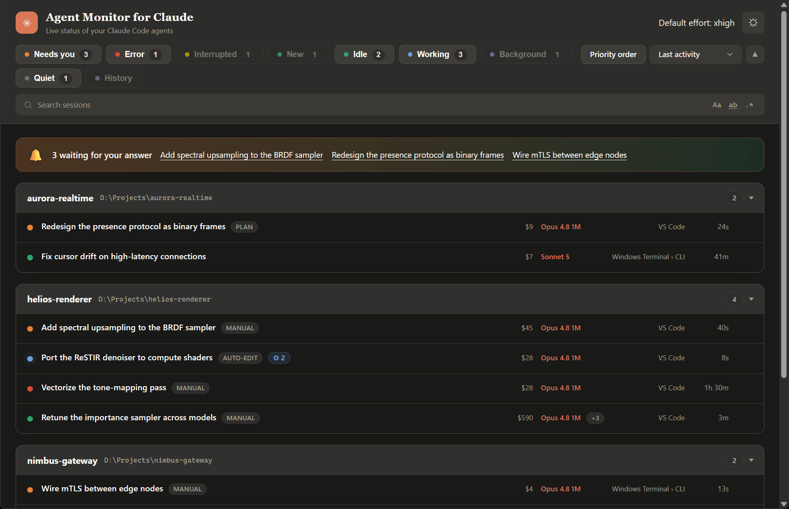

# Agent Monitor for Claude

A local desktop window that shows every running Claude Code agent at a glance - grouped by project, with each agent's live status: working, waiting for you, blocked on a permission prompt, or finished.

If you run many Claude Code agents across several projects, you cannot tell from the IDE which one is actually doing something and which is quietly waiting for you. Agent Monitor answers that in one glance.

> [!IMPORTANT]
> This project is still in an early stage. Detailed issue reports - with steps to reproduce, what you expected, and what actually happened - are very welcome and help a lot.



## Features

### It just works
- **Portable** - a single Windows executable, no installation.
- **Zero configuration** - it finds your Claude config directory automatically (honors `CLAUDE_CONFIG_DIR`).

### What you see every day
- **Live agent overview** - every running Claude Code agent, grouped by the project it belongs to, refreshed every few seconds.
- **Know who needs you** - a banner lists the agents blocked on a question, plan review, or permission prompt, with a one-click jump to each, so you never leave one hanging.
- **Status at a glance** - each agent shows *working*, *waiting for you*, *permission needed*, *interrupted* (you stopped it mid-turn), *error* (the turn hit a usage/session limit or other API error and cannot continue), or *finished*, with the time since its last activity.
- **Filter and sort to what matters** - the status chips (needs you, error, interrupted, new, idle, working, background, quiet, attention-first order) start all on, and you uncheck the ones you want to hide; each chip's colored dot doubles as the key to what the row dots mean, and hovering a chip explains what that status means and when it occurs; sort by activity, usage, model, host, or status. Your filter and sort choices are remembered across restarts.
- **Search session content** - a search box narrows the view to the sessions whose *transcript contains* what you type. As in your editor, three toggles refine it: match case, match whole word, and use a regular expression (an invalid pattern turns the box red); your choices are remembered. It searches only the sessions the active filter chips currently show (so it stays fast and covers exactly what you see), newest sessions first, running locally on demand with a progress bar and streaming results in as they are found; the chip counts update to match. Results stay current as your agents work - a running session that newly contains the text shows up on its own. Press Escape to clear it. The search reads transcript text only to answer "does this session contain the string?" - it reports back only which sessions matched, never any of their content, and nothing ever leaves your machine.
- **Urgent projects on top** - across all projects, the ones blocked on a prompt float above those actively working, which sit above the idle and finished ones; within each band the order stays stable so panels do not jump around on every status change. A toggle turns this off for a plain A-Z layout.
- **See where it runs** - each agent shows its host application (VS Code, JetBrains IDEs, terminals, and more), with a CLI marker for terminal-driven agents.
- **Cost at a glance** - each agent shows an estimated dollar cost (computed per model, so cheaper subagent models are priced right), with the full per-tier token breakdown - base input, output, cache read, and 5m/1h cache writes - one half-second hover away. Prices live in an editable `pricing.json` (see [docs/configuration.md](docs/configuration.md)); you can even enter a future price change under its start date and it applies on its own.
- **Subagents in flight** - a badge shows how many subagents an agent is running right now (and how many recently finished), with a hover listing what each is doing.
- **Background processes and task output** - a badge shows how many OS processes an agent is running (a watched build, a scan). Click it for a panel with a live per-process table (CPU, memory, and how long each has run, updated every second) and the agent's background tasks; expand a task to watch its live output stream in a mono-space console, so you can follow progress and estimate how long it still needs (if the task redirected its output to a file in its own scratchpad or project folder, the panel follows that redirect). Output is read only while you have a task expanded. For WSL agents the panel also shows the shared WSL2 virtual machine's total CPU and memory - where the real load lives, since WSL runs its Linux work inside that VM out of Windows' per-process view.
- **Jump right to it** - click an agent and its hosting window comes to the foreground; for VS Code extension sessions the exact session tab is focused via the extension's official deep link. Click a project's path in its panel header to open that folder in Windows Explorer.
- **Revisit and clean up past sessions** - a *History* chip (off by default) lists finished sessions that are no longer running - the ones `claude --resume` would show - grouped under their projects and loaded on demand. From a past session's row menu you can, after a confirmation, permanently delete its transcript and subagent files from disk. This deletion is the one thing the tool ever writes; everything else is strictly read-only, and a running session is never touched.

### Reach and preferences
- **Light and dark** - follows your system theme, with a one-click toggle in the header.
- **13 languages** - auto-detected from your system locale (English, German, Spanish, French, Hindi, Indonesian, Italian, Japanese, Korean, Brazilian Portuguese, Ukrainian, Simplified and Traditional Chinese).
- **Customizable** - an optional settings file tunes the poll interval and window size.

## Requirements

- Windows 10 / 11
- [Microsoft Edge WebView2 runtime](https://developer.microsoft.com/microsoft-edge/webview2/) (pre-installed on current Windows)
- Claude Code (this tool reads the session data it writes under `~/.claude/`)
- Python 3.10 or newer - only to run or build from source; the prebuilt executable bundles its own Python

## Getting started

### Prebuilt executable
Download `AgentMonitorForClaude.exe` from the [latest release](https://github.com/jens-duttke/agent-monitor-for-claude/releases) and run it. No installation.

### From source
```sh
python -m venv .venv
.venv\Scripts\pip install -r requirements.txt
.venv\Scripts\python -m agent_monitor_for_claude
```

## Configuration

All settings are optional. See [docs/configuration.md](docs/configuration.md) for the full reference and the settings-file search order.

## How it works

Agent Monitor reads the session registry and transcript metadata that Claude Code writes locally, and derives each agent's state from the last assistant turn's stop reason plus process liveness. See [docs/how-it-works.md](docs/how-it-works.md) for the details.

## Building

Building the standalone executable additionally needs PyInstaller, kept out of the runtime requirements:

```sh
.venv\Scripts\pip install -r requirements-dev.txt
.venv\Scripts\python build.py
```
Produces `dist/AgentMonitorForClaude.exe`.

## Developing

Iterate the UI in a browser, no Python or live session needed: open
`agent_monitor_for_claude/ui/index.html?mock` (or the file directly via `file://`).
It renders the showcase data from `ui/dev-mock.js` - a dev-only file that never
ships in the built executable.

## License

[MIT](LICENSE) (c) Jens Duttke
